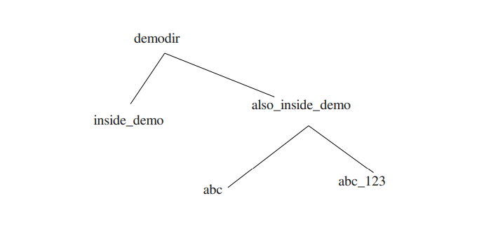

File Systems
1. Make a directory structure like this in your home directory

2. Remove the also_inside_demo directory

Ans:
──(kali㉿kali)-[~/Desktop]
└─$ mkdir demodir                         
                                                                                                                    
┌──(kali㉿kali)-[~/Desktop]
└─$ cd demodir
                                                                                                                    
┌──(kali㉿kali)-[~/Desktop/demodir]
└─$ mkdir inside_demo also_inside_demo    
                                                                                                                    
┌──(kali㉿kali)-[~/Desktop/demodir]
└─$ cd also_inside_demo 
                                                                                                                    
┌──(kali㉿kali)-[~/Desktop/demodir/also_inside_demo]
└─$ mkdir abc abc_123                  
                                                                                                                    
┌──(kali㉿kali)-[~/Desktop/demodir/also_inside_demo]
└─$ cd ..              
                                                                                                                    
┌──(kali㉿kali)-[~/Desktop/demodir]
└─$ ls
also_inside_demo  inside_demo
                                                                                                                    
┌──(kali㉿kali)-[~/Desktop/demodir]
└─$ rmdir also_inside_demo 
rmdir: failed to remove 'also_inside_demo': Directory not empty
                                                                                                                    
┌──(kali㉿kali)-[~/Desktop/demodir]
└─$ rm -r also_inside_demo 
                                                                                                                    
┌──(kali㉿kali)-[~/Desktop/demodir]
└─$ ls
inside_demo
                                                                                                                    
┌──(kali㉿kali)-[~/Desktop/demodir]
└─$ 

Notes:
rm -r command is used to remove the directory which is not empty. 